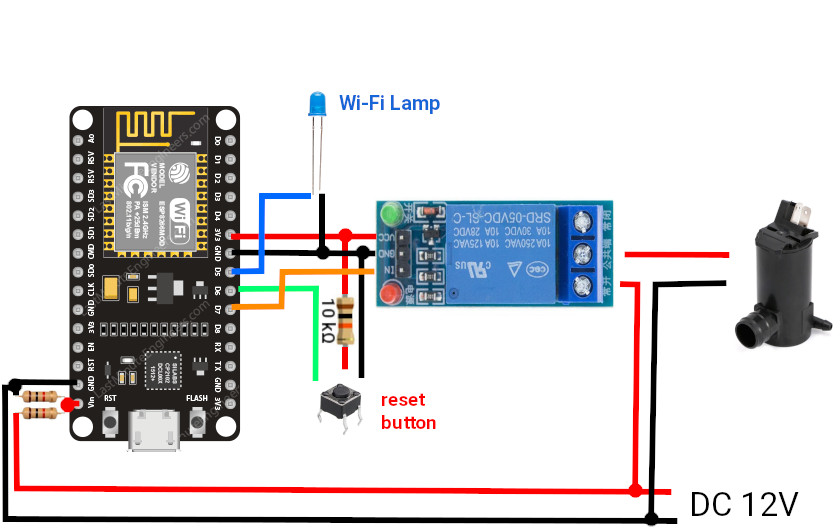

# Scheme

    

# Settings Arduino IDE

Board - esp8266 -> NodeMCU 1.0 (ESP-12E Mocule) \
 \
Preferences -> Bords URL -> http://arduino.esp8266.com/stable/package_esp8266com_index.json \
Boards manager -> esp8266

# Pins

D7 - Water pump controller \
D5 - Signal WI-FI lamp \
D6 - Reset button
